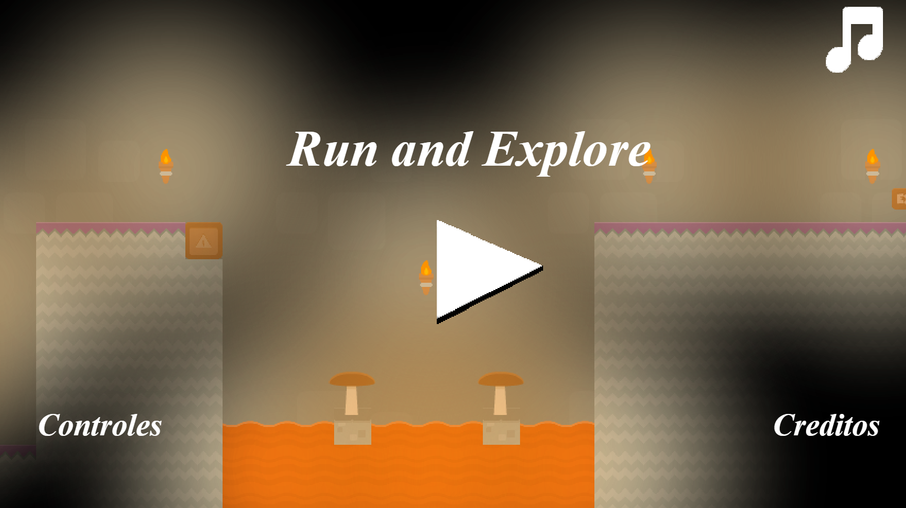
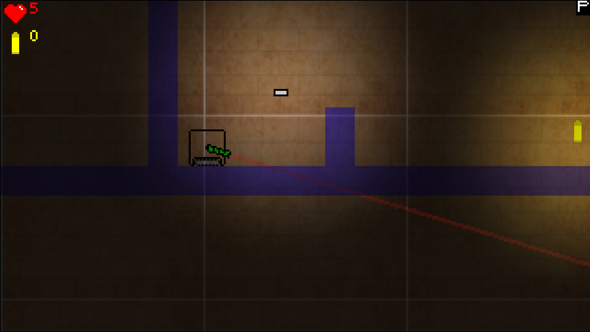
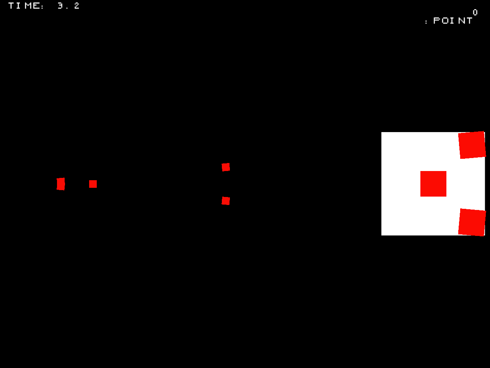
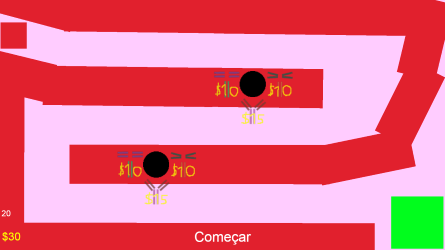
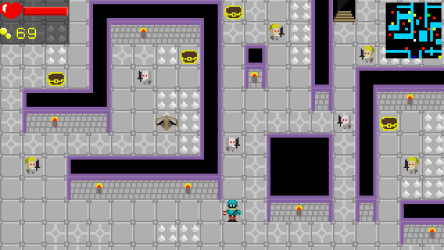
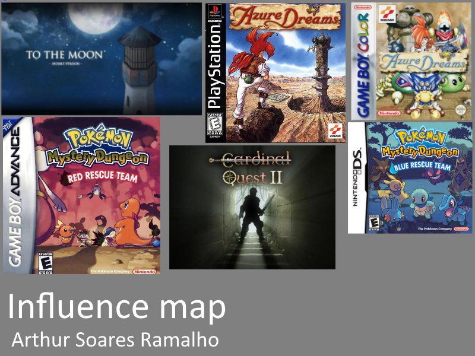
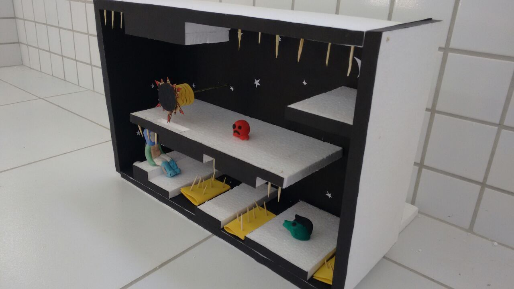
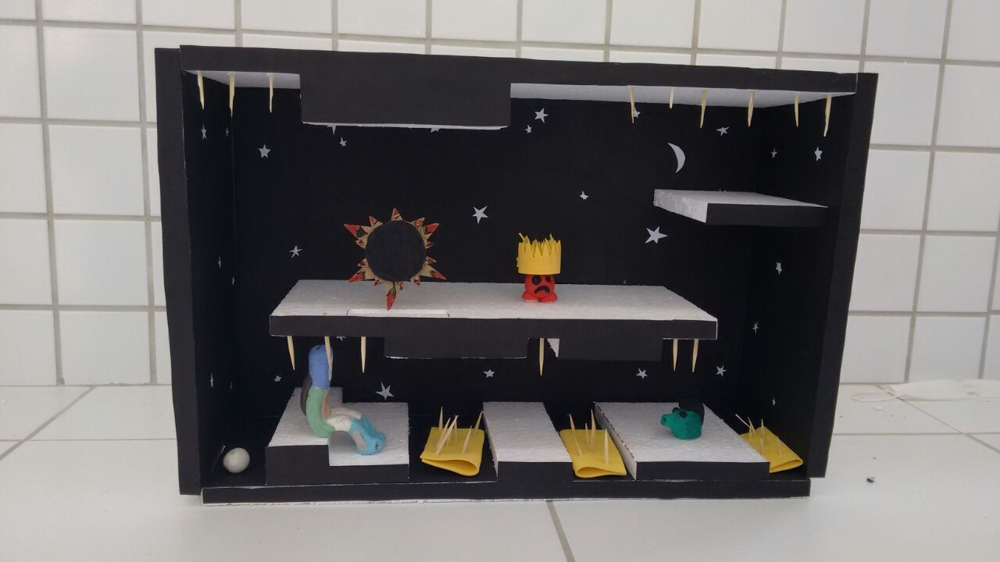

# Quem sou eu?  

Eu sou Arthur Soares Ramalho e estou cursando o 3° ano de programação de jogos Digitais, IFRN-campus Ceará-Mirim/RN.  

* * *  

# Contatos pessoais  

[Facebook](https://www.facebook.com/athur.soaresramalho)  
  

[Github](https://github.com/reiarthursr)  
  

E-mail: reiarthursr@gmail.com  

* * *  

# Produções  

## Games  

[Animal Skills](https://reiarthursr.github.io/Animal%20Skills/)  
  
[Hard Mode](https://reiarthursr.github.io/Animal%20Skills%20Hardcore/)  

[Run and Explore](https://reiarthursr.github.io/Run/)  
  

[Mundo Robô](https://reiarthursr.github.io/Mundo%20Robô/)  
  

[5 Segundos](https://reiarthursr.github.io/MiniGames/)  
  

[Tower Defense](https://reiarthursr.github.io/Torre/)  
  

[Mockup](https://reiarthursr.github.io/Mockup/)  
  

* * *  

## Artes  

  

* * *  

## Influence Map  

  

* * *  

## Projetos desenvolvidos  

Projeto de Interface - Maquete 3D de um Jogo  

Orientador (a): Marcelo de Barros Barbosa  
  
  
